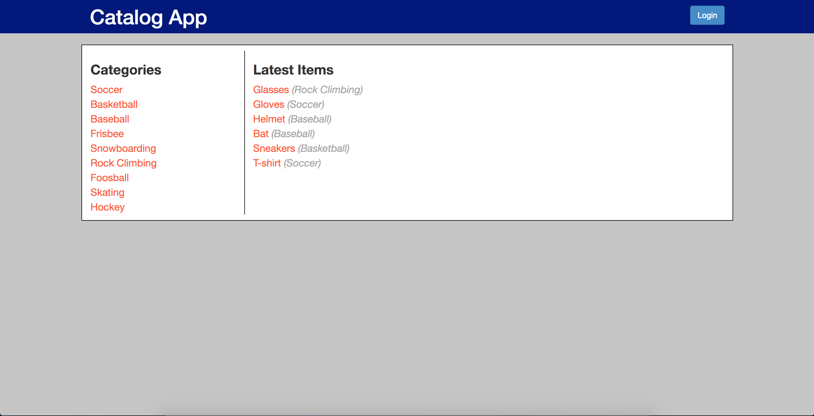
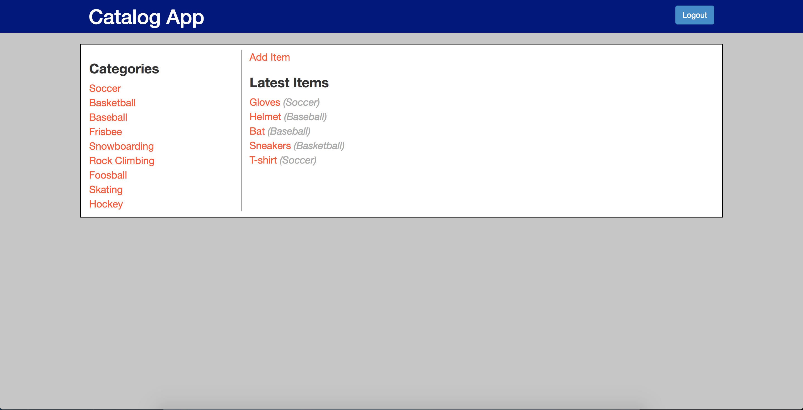
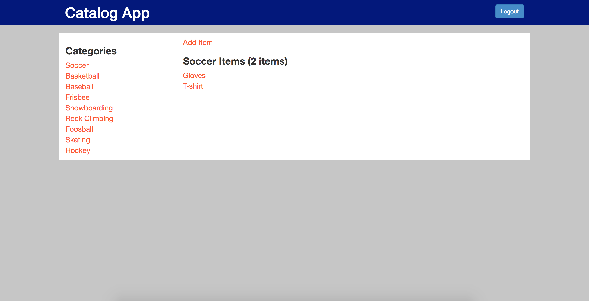
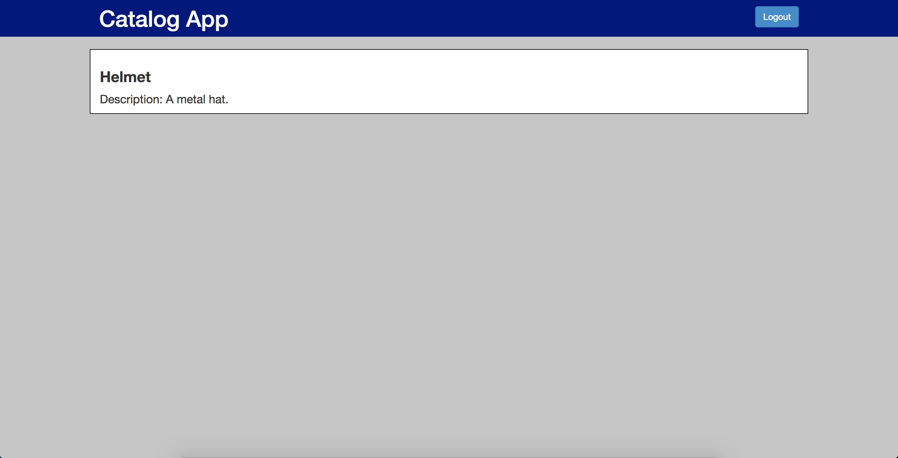
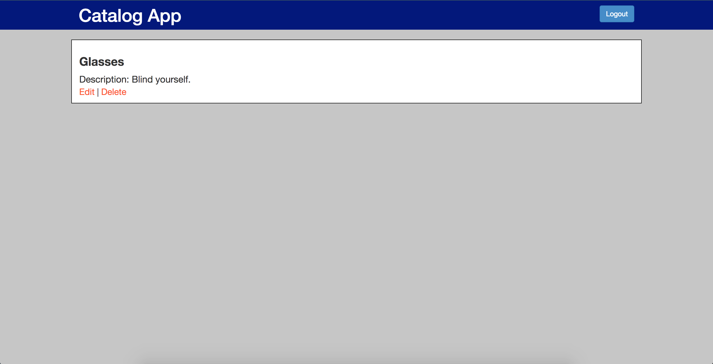
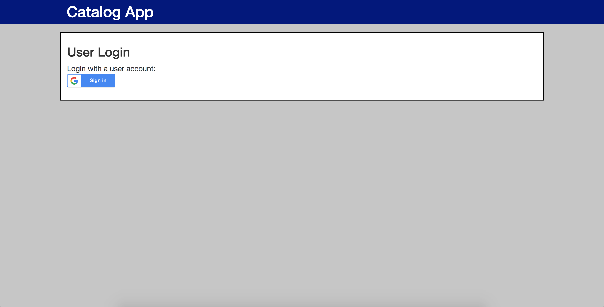
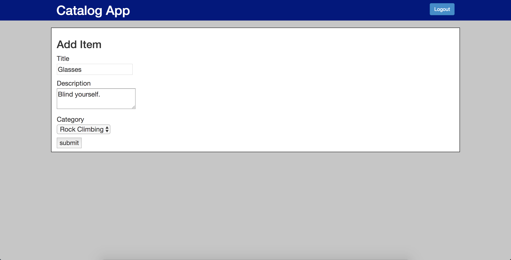
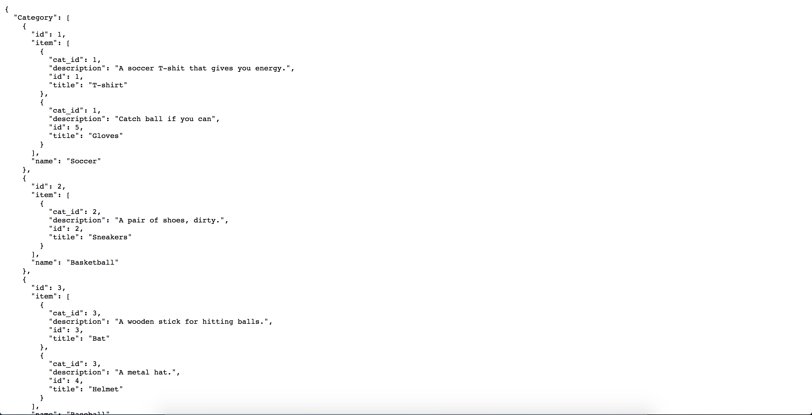

# Item_Catalog
This is a website that allows users to browse items in different catgories. The items are maintained by admins (users who have been authorized and authenticated by Google OAuth APIs). 

This site is hosted on AmazonLightsail at http://itsawesomeweb.tk/categories with a static ip address 52.35.137.157
- Users can add items (title, description, category).
- An item can only be updated/deleted by the user who created it.

## Skills Applied
1. MySQL database for data storage
2. Python server side back-end scripts running on Flask
3. Client side front-end web pages using Bootstrap JS framework for UI
4. A JSON endpoint that serves the same information as displayed in the HTML endpoints
4. RESTful APIs for CRUD implementations
5. Third party OAuth 2.0 service (Google) for user authentication
6. User token signing using Python module itsdangerous
7. Cross-Site Request Forgery (CSRF) protection using session state
8. Post-Redirect-Get (PRG) pattern to prevent false submission

## Database Schema
User

| Column        | Type          |
| ------------- |:-------------:|
| id            | Integer       |
| username      | String        |
| email         | String        |
| picture       | String        |
| passwor_hash  | String        |

Category

| Column        | Type          |
| ------------- |:-------------:|
| id            | Integer       |
| name          | String        |

Item

| Column        | Type          |
| ------------- |:-------------:|
| id            | Integer       |
| name          | String        |
| description   | String        |
| category_name | FK(Category)  |
| user_id       | FK(User)      |

## Usage

**JSON endpoint**

Generate signed tokens (Note: token expires after 10 mins)
```
$ curl -X POST -i -u "testuser":"testps" "http://itsawesomeweb.tk/tokens"

Response:
{
  "token": "eyJhbGciOiJIUzI1NiIsImV4cCI6MTUzMTg5NDY1OSwiaWF0IjoxNTMxODk0MDU5fQ.eyJpZCI6MX0.66mzV4LW6t3BsQMY2tYuBQ3xx8zZiNlPRf5M6IB5uro"
}
```

Get the app JSON data using token
```
$ curl -i -u tokenString:blank "http://itsawesomeweb.tk/categories.json"
```

Get the app JSON data using credential
```
$ curl -i -u "testuser":"testps" "http://itsawesomeweb.tk/categories.json"
```

## Website Screenshots
Show latest items (http://itsawesomeweb.tk/categories)


Show latest items (logged in) 


Show category items (http://itsawesomeweb.tk/categories/Soccer/items)


Show item description (http://itsawesomeweb.tk/categories/Baseball/Helmet)


Show item description (the user who created it) (http://itsawesomeweb.tk/categories/Rock%20Climbing/Glasses)


Login screen (http://itsawesomeweb.tk/login)


Add item (http://itsawesomeweb.tk/categories/items/add)


JSON endpoint (http://itsawesomeweb.tk/categories.json)

